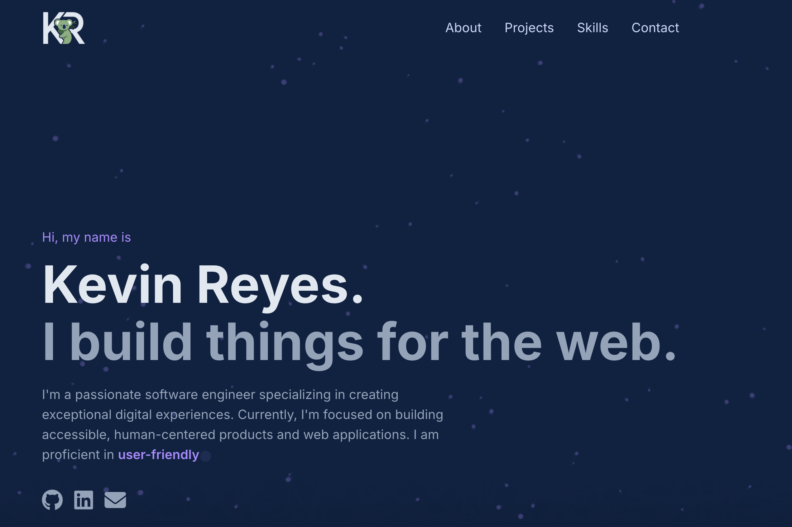

# Kevin Reyes - Software Engineer Portfolio

[](https://app.netlify.com/projects/kayrey-portfolio/deploys)
[](https://opensource.org/licenses/MIT)
[](https://kevbreyes.com)

**[🌐 View Live Portfolio →](https://kevbreyes.com)**



> "Building digital experiences that make a difference, one line of code at a time."

A modern, responsive portfolio website showcasing my skills, projects, and professional journey as a software engineer. Built with clean, semantic HTML, modern CSS, and vanilla JavaScript for optimal performance and maintainability.

## ✨ Features

- **Responsive Design**: Mobile-first approach with seamless desktop experience
- **Interactive Elements**: Custom cursor, particle background, and smooth scroll animations
- **Progressive Web App**: Service worker for offline functionality and app-like experience
- **Performance Optimized**: Optimized images, efficient CSS, and minimal JavaScript
- **Accessibility Focused**: Semantic HTML, proper ARIA labels, and keyboard navigation
- **Modern UI/UX**: Clean typography, smooth transitions, and intuitive navigation

## 🛠️ Technologies Used

### Frontend

- **HTML5**: Semantic markup and structured content
- **CSS3**: Custom properties, animations, and responsive design
- **Tailwind CSS**: Utility-first CSS framework for rapid development
- **JavaScript (ES6+)**: Vanilla JS for interactivity and animations

### Build Tools

- **Tailwind CSS CLI**: For CSS compilation and optimization
- **Node.js**: Package management and build scripts

### Deployment

- **Netlify**: Continuous deployment and hosting
- **Git**: Version control and collaboration

## 🚀 Getting Started

### Prerequisites

- Node.js (v14 or higher)
- npm or yarn package manager

### Installation

1. Clone the repository

   ```bash
   git clone https://github.com/kay-rey/kayrey-portfolio.git
   cd kayrey-portfolio
   ```

2. Install dependencies

   ```bash
   npm install
   ```

3. Build the CSS

   ```bash
   npm run build
   ```

4. Open `index.html` in your browser or serve locally

### Development

- **Build CSS**: `npm run build`
- **Watch for changes**: `npm run build` (run manually as needed)

## 📁 Project Structure

```
kayrey-portfolio/
├── assets/                 # Images, icons, and media files
│   ├── favicons/          # Favicon and app icons
│   ├── images/            # Project screenshots and graphics
│   └── documents/         # Resume and other documents
├── dist/                  # Compiled CSS output
├── src/                   # Source files
│   └── input.css          # Tailwind CSS input file
├── index.html             # Main HTML file
├── sw.js                  # Service worker for PWA
├── site.webmanifest       # Web app manifest
├── browserconfig.xml      # Microsoft Edge configuration
├── tailwind.config.js     # Tailwind CSS configuration
├── package.json           # Dependencies and scripts
└── README.md              # Project documentation
```

## 🎨 Design System

### Color Palette

```css
:root {
	--primary-color: #a78bfa; /* Vibrant Purple */
	--dark-navy: #081425; /* Dark Navy */
	--light-navy: #112240; /* Light Navy */
	--lightest-navy: #233554; /* Lightest Navy */
	--slate: #8892b0; /* Slate */
	--light-slate: #a8b2d1; /* Light Slate */
	--lightest-slate: #ccd6f6; /* Lightest Slate */
}
```

### Typography

- **Primary Font**: Inter (Google Fonts)
- **Weights**: 400 (Regular), 500 (Medium), 600 (Semi-bold), 700 (Bold)
- **Hierarchy**: Clear visual hierarchy with consistent spacing

## 📱 Responsive Design

- **Mobile First**: Designed for mobile devices first, then enhanced for larger screens
- **Breakpoints**: Responsive grid system using Tailwind CSS utilities
- **Touch Friendly**: Optimized for touch interactions on mobile devices
- **Flexible Layout**: Adaptive grid system that works across all device sizes

## ⚡ Performance Features

- **Optimized Images**: WebP format with fallbacks for broader compatibility
- **Efficient CSS**: Tailwind CSS with purged unused styles
- **Minimal JavaScript**: Vanilla JS without heavy frameworks
- **Service Worker**: Caching strategy for improved loading times
- **Lazy Loading**: Images and content loaded as needed

## 🔧 Development Workflow

1. **Local Development**: Build CSS and test locally
2. **Version Control**: Commit changes with descriptive messages
3. **Deployment**: Automatic deployment via Netlify on push to main branch
4. **Testing**: Cross-browser testing and responsive design validation

## 🌐 Browser Support

- **Modern Browsers**: Chrome, Firefox, Safari, Edge (latest versions)
- **Mobile Browsers**: iOS Safari, Chrome Mobile, Samsung Internet
- **Progressive Enhancement**: Core functionality works in all browsers

## 📊 Project Highlights

### Featured Projects

- **ClarifyMed**: AI-powered medical documentation tool (Next.js, React, MongoDB)
- **Catchimal**: Award-winning sustainability app (HTML, CSS, JavaScript)
- **Personal Portfolio**: This website showcasing modern web development

### Key Achievements

- **Hackathon Winner**: "Best Hack for Sustainability" at Catchimal project
- **48-Hour MVP**: Rapid development and deployment capabilities
- **Team Leadership**: Experience leading development teams and coordinating projects

## 📞 Contact & Connect

- **Portfolio**: [kevbreyes.com](https://kevbreyes.com)
- **GitHub**: [@kay-rey](https://github.com/kay-rey)
- **LinkedIn**: [kevbreyes](https://linkedin.com/in/kevbreyes)
- **Resume**: [Download PDF](assets/KevinReyes-Resume.pdf)

## 📄 License

This project is licensed under the MIT License - see the [LICENSE](LICENSE) file for details.

---

**Built with ❤️ and ☕ by Kevin Reyes**

_Last updated: December 2024_
